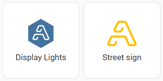

# Artifactory Icons

Artifactory specific icons for Home Asisstant



## Installation

 1. Add the folowing to the `frontend` section of your `configuration.yaml`

  ```yaml
frontend:
  extra_module_url:
    - /local/community/artifactory-icons/artifactory-icons.js
```
2. (optional) Or add the following to your lovelace configuration using the Raw Config editor under Configure UI or ui-lovelace.yaml if using YAML mode.

```yaml
resources:
  - type: js
    url:  /local/community/artifactory-icons/artifactory-icons.js
```

3. Restart Home Assistant

## Usage

Use `af:<icon>` the same way you would any other icon. [These](https://github.com/Perth-Artifactory/artifactory-icons/tree/main/svg) are the supported icons

## Thanks

* Icons were created by [Jim Tuckwell](https://www.instagram.com/jimandtonic__) (stored [here](https://github.com/perth-artifactory/branding))
* Installation instructions based on [custom brand icons](https://github.com/elax46/custom-brand-icons)